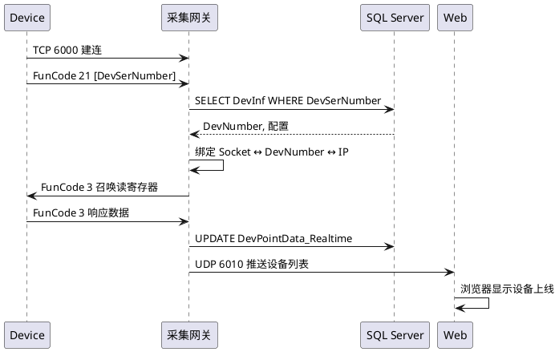
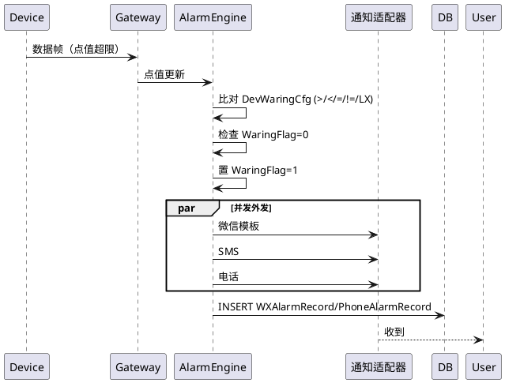

# 江苏润盛 ModBus 物联网监控平台 — 现状功能全景清单

> **文档用途**：用于对旧系统"功能等价重做"的需求基线和协议规范基线。不关心原技术栈，只描述"系统做了什么 / 用户能做什么 / 对外契约是什么 / 协议字节层怎么走"。
> **来源**：对 `D:\江苏润盛\ModBusServer20210908`、`D:\江苏润盛\ModBusWeb20210908`、`D:\江苏润盛\DataBase` 三份源代码和数据文件的逆向分析 + 三角色（系统分析师 / 代码分析师 / 通讯工程师）审查。
> **版本**：v2.2 / 2026-04-13
> **变更记录**：
> - v1.0：初始版本（功能全景 + 数据模型）
> - v2.0：融合三角色审查意见；新增权限矩阵、告警判定表、离线状态机、用户旅程、协议附录 A–H；写入 5 项业务决策。
> - v2.1：从旧版本 `ModBusWeb20210811` 和"电能终端波形分析工具"挖出 4 个 P0/P1 答案并回填（Q-D02/D03/B01/B05），Q-P07/P08/B02 部分澄清。
> - v2.2：新增业务决策 D6（RS485 通讯规格）+ D7（空函数砍需求原则）；核查确认 21 个 .aspx 是空壳、FunCode 7/12 未实现、FunCode 13/26 只是 3/6 的变种；补入 FFT 频谱 + OPM 平衡系数两个主文档遗漏的功能；新增 §12 已砍伪需求清单。

---

## 目录

- §0 系统定位
- §1 架构全貌
- §2 四大角色与核心能力
- §3 对外接口契约（含权限矩阵与多租户）
- §4 数据模型
- §5 配置与环境
- §6 重做范围边界
- §7 技术债与性能指标
- §8 交付与验收
- §9 关键用户旅程（User Journey）
- §10 业务决策记录（Decisions Log）
- **§11 已砍伪需求清单**（v2.2 新增）
- **§12 主文档遗漏的功能**（v2.2 补入 FFT / OPM / Export 路径）
- **§13 待澄清问题清单（Open Questions）**
- §A 协议附录：ModBus 功能码完整规范
- §B 网络拓扑与端口映射
- §C API Schema 附录（JSON / 文本协议）
- §D 时序约束与错误码总表
- §E 并发模型与线程拓扑
- §F 告警引擎状态机判定表
- §G 历史库归档策略
- §H 安全改进建议
- §I 文件级对照索引

---

## §0 系统定位一句话

**石油、工业设备远程监控 SCADA 平台**（主要服务于采油机、保温/电气/液位/温湿度设备）。
现场 ModBus 设备 → 4G/串口 → 采集网关 → SQL Server → PC / 移动 H5 / 微信公众号三端用户。
附带：告警引擎（短信/邮件/微信/电话）+ 微信支付充值 + 可视化自定义组态。

---

## §1 架构全貌（v2.2 修订，依据业务决策 D6）

```
 ┌─────────────────────────────────────────────────────────────────────┐
 │            现场设备（RS485 从站，每总线 ≤ 128 台）                 │
 │   采油机 │ 电气控制器 │ 保温控制器 │ 温湿度/液位节点  …             │
 └──────┬────────┬───────┬─────────┬──────────────────────────────────┘
        │        │       │         │  RS485 半双工总线
        ▼        ▼       ▼         ▼  ModBus RTU（含 CRC16）
 ╔═══════════════════════════════════════════════════════════════════╗
 ║   RS485 主站 / 4G DTU（现场汇聚）                                 ║
 ║   - 轮询每台从站：周期 1.0~100.0s（精度 0.1s，每台独立可配）      ║
 ║   - 把 RS485 帧**透传**或**封装**后经 TCP 上云                    ║
 ╚════════════════════════════════┬══════════════════════════════════╝
                                  │ TCP（见 §B 端口表）
                                  ▼
 ┌────────────────────────────────────────────────────────────────────┐
 │      采集网关  ModBusServer.exe  (WinForms, .NET 4.5.2)            │
 │  端口 6000 / 6010 / 6020 / 6030 / 6040  + 可选本机 SerialPort     │
 │  6 主线程 + N 动态子线程（召唤/解析/入库/推送/WebAPI/离线/Token） │
 │  告警引擎 + 邮件/微信/电话/短信通知 + 批量落库                    │
 │  抽油机专用：FFT 频谱（§FFT）+ 平衡系数 OPM 算法（§OPM）          │
 └─────────────────────┬──────────────────────────┬──────────────────┘
                       │                          │
                 SQL Server                 TCP 6030 (JSON)
                       │                    UDP 6010 (广播)
                       │                          │
 ┌─────────────────────▼──────────────────────────▼──────────────────┐
 │      Web 端 IOTWeb (ASP.NET WebForms, IIS, .NET 4.6.1)             │
 │   核心：**8 个 Ajax 接口**（真正的业务逻辑都在这里）              │
 │   .aspx 页面多为容器/空壳（v2.2 核查 21 个 Page_Load 为空）        │
 │   → 新系统直接 SPA + REST，不必 1:1 重做 .aspx                    │
 └────────────────────────────────────────────────────────────────────┘
                       │
 ┌─────────────────────▼──────────────────────────────────────────────┐
 │   终端用户：浏览器 / 安卓 App(APK) / 微信公众号                   │
 └────────────────────────────────────────────────────────────────────┘
```

### §1.1 拓扑关键参数（业务决策 D6）

| 层级 | 规格 |
|---|---|
| 现场总线 | **RS485**（半双工，ModBus RTU） |
| 总线容量 | 每条 RS485 **≤ 128 台从站**（受 RS485 电气特性和 ModBus RTU 地址空间约束）|
| 轮询周期 | 每台从站**独立**配置，区间 **1.0s – 100.0s**，步长 **0.1s** |
| 上云链路 | DTU → TCP → 采集网关（设备不直接上云）|
| 故障场景 | DTU 断线 → 本总线上所有 ≤128 台设备一起离线 |

---

## §2 四大角色与核心能力

### 2.1 现场设备（被管端）— v2.2 修订

**物理层与协议**（业务决策 D6）：RS485 + ModBus RTU（含 CRC16）。

| 能力 | 协议 / 功能码 | 状态 | 说明 |
|---|---|---|---|
| 注册上线 | 私有 FunCode 21 | ✅ 保留 | 上报设备序列号，网关绑定 DTU-IP-DevNumber |
| 低功耗注册 | 私有 FunCode 22 | ✅ 保留 | 简化注册流程，低功耗模块专用 |
| **数据采集响应** | ModBus FunCode 3（含变种 13） | ✅ 保留 | 读保持寄存器；FunCode 13 是 3 的变种，代码里合并处理 `if (FunCode==3 \|\| FunCode==13)`（ModBusServer.cs:1744），**不是独立命令** |
| **参数设值** | ModBus FunCode 6（含变种 26） | ✅ 保留 | 单寄存器写；FunCode 26 是 6 的变种，`if (FunCode==6 \|\| FunCode==26)`（ModBusServer.cs:1825），**不是独立命令** |
| 单线圈写 | ModBus FunCode 5 | ✅ 保留 | — |
| 多寄存器写 | ModBus FunCode 16 (0x10) | ✅ 保留 | 批量设置 |
| SIM 卡 ICCID 上报 | 私有 FunCode 20 | ✅ 保留 | 绑定 SIM 卡信息 |
| 响应确认 | 私有 FunCode 100 | ✅ 保留 | 通用响应 |
| ~~请求服务 FunCode 7~~ | ~~私有~~ | ❌ **已砍（D7）** | 代码里**无 case 分支**（核查 v2.2），未实现功能 → 不做 |
| ~~寄存器同步 FunCode 12~~ | ~~私有~~ | ❌ **已砍（D7）** | 代码里**无 case 分支**（核查 v2.2），未实现功能 → 不做。配置下发走别的路径（SyncTime/UpdateFlag + FunCode 6/16） |
| 接收控制/告警配置/定时计划下发 | — | ✅ 保留 | 服务端通过 SyncTime/UpdateFlag 同步，用 FunCode 6/16 下发 |

> 各功能码的字节级帧结构详见 **§A 协议附录**。FunCode 7/12 的澄清问题 Q-P03/Q-P04 按 D7 原则**已关闭**。

### 2.2 采集网关（ModBusServer.exe）

#### 2.2.1 对外端口清单

| 端口 | 协议 | 连接模式 | 方向 | 用途 |
|---|---|---|---|---|
| **TCP 6000** + GroupID | TCP | 长连接 | 双向 | 设备主连，注册 |
| **UDP 6010** + GroupID | UDP | 无连接 | 推送 | Web 后端获取实时设备列表 |
| **TCP 6020** + GroupID | ModBus TCP | 长连接 | 双向 | 设备数据采集主通道 |
| **UDP 6020** + GroupID | UDP | 无连接 | 双向 | ModBus 映射 / IP 广播 |
| **TCP 6030** + GroupID | TCP+JSON | 长连接 | 双向 | Web 后端拉数据 / 下发控制 |
| **TCP 6040** + GroupID | TCP+CSV 文本 | 短连接 | 双向 | 第三方简易 API |
| **串口** | SerialPort | — | 双向 | 本地 ModBus RTU |

> 说明：`GroupID` 是服务分组 ID（默认 1），端口号按 `BasePort + GroupID` 计算；同一台机器可跑多个分组。
> TCP 长连接接收超时 60s 或 900s（依不同通道，见 §D）。

#### 2.2.2 后台线程总览

| 类别 | 线程 | 数量 | 职责 |
|---|---|---|---|
| **主线程** | Thread_ModBusCall | 1 | 定时召唤数据，30s 间隔 |
| | Thread_ModBusProess | 1 | 解析接收帧、触发告警 |
| | TheadInDataBase | 1 | 批量事务入库（现状 `MinTransactionCnt=1` 伪批量） |
| | UDP_SeverWeb | 1 | UDP 6010 广播 |
| | TCP_WebAPI | 1 | 6030 JSON API 监听 Accept |
| | DevOffLineProess | 1 | 离线检测与清理 |
| | TimedCall（内含） | 1 | SIM 流量 / 固件升级 / Token 刷新 |
| **动态子线程** | ModBusReceive / TCPReceive | N | 每个设备连接一个 |
| | WebAPI / StringAPI | N | 每个 API 连接一个 |
| | Token 刷新 | 1+ | 每个 WXGroup 一个 |

#### 2.2.3 告警引擎概要

> 状态机详细判定表见 **§F 告警引擎状态机判定表**。

- **触发条件类型（AlarmType）**：`>` / `<` / `=` / `!=` / `LX`（连续触发消抖）
- **复合条件**：`RelationPointID` + `RelationAlarmType` + `RelationLimitValue`（A 点超限且 B 点满足时才告警）
- **状态机字段**：`Enable` / `WaringFlag`（去重核心）/ `ActionFlag` / `DevSyncFlag` / `ResetRemind` / `PhoneAlarm`（高 8 位=故障复位动作，低 8 位=电话选项）
- **外发渠道**：微信模板消息、邮件 SMTP、电话告警（入队第三方平台）、短信（通用网关）

#### 2.2.4 设备身份与生命周期

**身份识别策略**（v2.0 业务决策已定 —— 通用方案）：
- **主识别**：`DevSerNumber`（硬件序列号，FunCode 21/22 注册包携带）
- **辅识别**：`iccid`（SIM 卡 ID，FunCode 20 上报）
- **映射表**：`DevInf.DevSerNumber ↔ DevInf.iccid ↔ DevInf.DevIP`
- **变更场景**：
  - SIM 换卡：DevSerNumber 不变，iccid/DevIP 更新 → 认定为同一设备
  - 硬件更换：DevSerNumber 变化 → 新设备，需人工在 DevInf 重新绑定 DevNumber

#### 2.2.5 离线判定状态机（新增，Blocker B4）

```
 ┌──────────┐  收到数据    ┌──────────┐
 │  初始    │─────────────▶│  在线    │
 │ (未注册) │  FunCode 21   │ LossCnt=0│◀──┐
 └──────────┘               └────┬─────┘   │
      ▲                          │ 30s 未应答
      │ 2min 仍未数据           │ LossCnt++
      │ 从 SocketList 移除      │
      │                          ▼
      │                    ┌──────────┐
      │                    │ 告警态   │ LossCnt ≥ 3 或
      └────────────────────│ 通信异常 │ LastCallTime+15min<Now
                           └────┬─────┘
                                │
                                ▼
                           ┌──────────┐
                           │  离线    │
                           │ OffLine  │ 写 CommLogCCID
                           └──────────┘
```

**关键阈值**（v2.2 修订：按业务决策 D6 改为可配）：

| 阈值 | v1.x 旧值 | v2.2 新规格 | 代码位置 |
|---|---|---|---|
| **单终端轮询间隔** | 固定 30s | **每终端独立配置，[1.0, 100.0] s，步长 0.1s** | 存于 `DevPointInf.UpdateInterval`（类型升级）|
| DEV_REREG_INTERVAL（未注册重召唤）| 10s | 可配，默认 10s | ModBusServer.cs:74 |
| 离线判定 | 15 min 无数据 | 可配，默认 15 min | ModBusServer.cs:857 |
| 注册后 2 min 仍无数据 → 清除 | 120s | 可配，默认 120s | ModBusServer.cs:2714 |
| 单次 Receive 超时 | 60s / 900s | 可配 | ModBusServer.cs:441, 597 |

**轮询调度实现说明**（新增）：
- 每条 RS485 总线上 ≤128 台终端
- DTU/网关按**轮询表**顺序扫描，每台按自己的 `UpdateInterval` 决定"该不该召唤"
- 同一总线上所有终端召唤总用时必须 ≤ 单台最小 `UpdateInterval`，否则需要警告或拒绝配置
- 示例：128 台 × 0.2s/台 = 25.6s/轮 → 最小可配 `UpdateInterval` 应 ≥ 26s，低于则前端应拒绝

**离线期间的控制指令策略**（v2.0 新增规则）：
- 控制指令进入 **离线命令队列**（内存 + 可选持久化）
- 有效期：默认 10 min，超期丢弃并告警
- 设备重连后 → 按入队顺序下发 → 逐条等待 ACK

### 2.3 终端用户（功能矩阵）

> **MVP 分级（v2.0 业务决策已定，方案丙同意）**：v1.0 上线只需 P0 全部 + P1 中"告警管理、设备配置、用户组织"3 项，P2/P3 延后。

| # | 业务模块 | 子功能 | PC | 移动 H5 | 微信 | 优先级 |
|---|---|---|---|---|---|---|
| 1 | **登录注册** | 手机号+密码登录 | Default/Login | PhoneFrame | Default_WX(OAuth) | **P0** |
| | | 短信验证码注册 | — | PhoneUserReg/PhoneNewUser | Ajax:UserReg | **P0** |
| | | 注销账号 | — | — | Ajax:LoginOff | P1 |
| | | 微信绑定/解绑 | — | — | Ajax:WXBind/CancelBind | P1 |
| | | 修改密码 | UserSet | PhoneSet | — | **P0** |
| | | 发送短信验证码 | — | — | Ajax:SendVFCode | **P0** |
| 2 | **门户导航** | 设备树+多选 | ShowData | — | — | **P0** |
| | | iframe 主框架 | FrameView | PhoneFrame | — | **P0** |
| | | 欢迎/跳转 | Welcom/Jump | — | — | P3 |
| 3 | **实时监控** | 全设备实时数据 | DataList | PhoneData | — | **P0** |
| | | 单设备完整信息 | DevInfo | PhoneFullInf | — | **P0** |
| | | 保温/电气专项 | Hot | — | — | P1 |
| | | 控制操作记录 | ControlRecord | — | — | P1 |
| 4 | **远程控制** | 批量广播控制 | DataList | — | — | **P0** |
| | | 启停控制按钮 | Hot | PhoneControl | — | **P0** |
| | | 通道/开关/设备改名 | — | PhoneChange* | Ajax | P1 |
| | | 单点赋值 | — | — | Ajax:SetValue/SetMultValue | P1 |
| 5 | **历史与报表** | 历史时段查询 | His | PhoneFullInf | — | **P0** |
| | | 日报表（导 Excel） | Report | PhoneDayReport | — | **P0** |
| | | 月报表（导 Excel） | MonthReport | — | — | P1 |
| | | 单日报警历史 | DayWaring | — | — | P1 |
| | | **历史数据批量导出**（新增 S3） | — | — | — | P1 |
| 6 | **波形分析** | 波形查看 | JSWave(嵌入 His) | PhoneWave | — | P1 |
| | | 双时段波形对比 | Wave | — | — | P1 |
| 7 | **告警管理** | 告警查询/复位 | DevWaring | PhoneWaring/WaringNew | — | **P0** |
| | | 阈值/上下限配置 | DevWaringCfg(导出) | PhoneCfgLimit | — | **P0** |
| | | 复制告警配置 | — | — | Ajax:CopyWaringCfg | P1 |
| | | 添加告警手机号 | AddPhoneNumber | PhoneAddMsgNumber | — | **P0** |
| | | 添加告警邮箱 | — | PhoneAddEmail | — | P1 |
| | | 推送消息中心 | — | PhoneMsg | 模板消息 | **P0** |
| 8 | **设备配置** | 比例系数 | RatioCfg | — | — | P1 |
| | | 通讯字段（采样/上报/服务器/升级文件/组包）| FiledCfg | — | — | P1 |
| | | 系统名称 | ChangeSysName | — | — | P2 |
| | | 静态信息 | DevStaticInf | — | — | P2 |
| | | 添加设备 | — | PhoneAddDev | — | P1 |
| 9 | **保养维护** | 保养计划+预警+操作记录 | Maintain | — | — | P2 |
| 10 | **定时计划** | 定时任务增删启停 | TimingPlan/Add | — | Ajax:SavePlan/Copy/Enable | P2 |
| 11 | **组态画面 ZT*** | 画布拖拽编辑 | ZTViewCfg | — | — | P2 |
| | | 组态运行视图 | ZTView | — | — | P2 |
| | | 修改背景图 | ZTModifyBackground | — | — | P3 |
| 12 | **用户/组织** | 集团-公司-部门管理 | GroupCompanyUser/AddGroupUser | — | — | P1 |
| | | 申请集团认证 | ApplyGroupCompany | — | — | P3 |
| | | 用户列表/权限 | — | PhoneUser | Ajax:GetUserList | P1 |
| 13 | **支付充值** | 设备充值 | DevRecharge | — | Pay(微信 JSAPI/扫码) | P2 |
| 14 | **运维辅助** | App 下载页 | AppDownLoad | — | — | P3 |
| | | 关于/联系 | About/Contact | — | — | P3 |

### 2.4 管理员 / 平台方 / 运维 / 合规

> 新增运维、集成商、合规/审计三类角色视角（系统分析师审查反馈）

| 角色 | 主要诉求 | 对应功能 |
|---|---|---|
| **平台管理员（SuperAdmin）** | 多租户管理、全局监控 | WXGroup 配置、用户审批、日志审计 |
| **集团/公司管理员** | 本租户内的组织与设备 | GroupCompanyUser、设备导入/批量改配、告警规则模板 |
| **现场运维工程师** | 快速故障定位 | 设备详情、控制日志、实时波形、离线设备清单 |
| **集成商 / 第三方** | 对接接口 | TCP 6040 CSV 协议、TCP 6030 JSON 协议（见 §C） |
| **合规 / 审计员** | 追溯操作与告警 | UserControlAction、SoftLog、UserLoginRecord（只读） |

---

## §3 对外接口契约

### 3.1 设备协议（采集网关 ↔ 现场设备）
- 基础：**ModBus RTU / ModBus TCP**，CRC16 校验
- 私有扩展：FunCode 7 / 12 / 20 / 21 / 22 / 100，**以及待澄清的 13 / 26**
- 字节级帧结构：见 **§A 协议附录**
- 时序/错误码：见 **§D**

### 3.2 Web 后端 ↔ 采集网关
- **TCP 6030（JSON）**：Web 下发控制、拉实时点值（Schema 见 §C.1）
- **UDP 6010**：网关 → Web 后端推送实时设备列表（Schema 见 §C.2）

### 3.3 Web 前端 ↔ Web 后端（8 个 Ajax 接口）

| 接口 | 鉴权 | 用途 |
|---|---|---|
| **UserData.aspx** | 视场景 | 账户全家桶（7 种 DataType）|
| **GetPostData.aspx** | 用户名密码 | PC 登录 + 登录日志 |
| **GetDevData.aspx** | Cookie | **设备数据/控制总线（38 种 DataType，修正）** |
| **GetChartData.aspx** | Cookie | 历史/波形/对比/列表（15 种 DataType）|
| **GetCalData.aspx** | 用户名密码 | 计量数据（电量）V1/V2 |
| **GetDevMap.aspx** | 用户名密码 | 地图设备列表 |
| **GetSimState.aspx** | 内部 Token | SIM 状态（4 种 DataType，含移动 OpenAPI）|
| **GetZTData.aspx** | 用户名 | 组态画面数据 |

#### 3.3.1 GetDevData 的 38 种 DataType（完整枚举，修订）

> 代码实际 38 个 case 分支（`Ajax/GetDevData.aspx.cs`），v1.0 文档漏列。

| 分组 | DataType | 含义 | MVP |
|---|---|---|---|
| **查询** | DevInfo | 单设备信息 | P0 |
| | DevList | 用户设备列表 | P0 |
| | DevListData | 列表 + 实时点值 | P0 |
| | SimpleDevList | 简化设备列表 | P0 |
| | SigDevData | 单设备实时数据 | P0 |
| | ControlRecord | 控制记录 | P1 |
| | HisWave | 历史波形 | P1 |
| | SimList | SIM 卡列表 | P1 |
| | WaringList | 告警列表 | P0 |
| | GetUser | 当前用户信息 | P0 |
| | GetUserList | 组员列表 | P1 |
| | GetPhoneNumber | 告警手机号列表 | P0 |
| | GetEmail | 告警邮箱列表 | P1 |
| **设备配置** | ReadRatio | 读比例系数 | P1 |
| | WriteRatio | 写比例系数 | P1 |
| | CfgLimit | 读/写上下限 | P0 |
| | ChangeChanelName | 改通道名 | P1 |
| | ChangeSwitchName / SwitchName | 改开关名 | P1 |
| | ChangeDevName | 改设备名 | P1 |
| | ChangeStaticValue | 改静态属性值 | P2 |
| | ChangeSysName | 改系统名 | P2 |
| | ChangeControlAuthority | 改控制权限 | P1 |
| **设备增删** | AddDev | 添加设备 | P1 |
| | DeleteDev | 删除设备 | P1 |
| **定时计划** | SavePlan | 保存计划 | P2 |
| | DeletePlan | 删除计划 | P2 |
| | CopyTimePlan | 复制计划 | P2 |
| | PlanEnableChange | 启用/禁用 | P2 |
| **告警配置** | CopyWaringCfg | 复制告警配置 | P1 |
| **通讯录** | AddPhoneNumber | 加告警手机号 | P0 |
| | DeletePhoneNumber | 删告警手机号 | P0 |
| | AddEmail | 加告警邮箱 | P1 |
| | DeleteEmail | 删告警邮箱 | P1 |
| | AddGroupUser | 加组员 | P1 |
| | DeleteGroupUser | 删组员 | P1 |
| **远程控制** | Control | ModBus 原生控制（分隔符 `|`：DevNumber\|DevAddr\|FunCode\|RegAddr\|Value） | **P0** |
| | SetValue | 单点赋值 | **P0** |
| | SetMultValue | 多点赋值 | P1 |

#### 3.3.2 GetChartData 的 15 种 DataType

| 分组 | DataType | 说明 |
|---|---|---|
| 告警配置 | SetValueChange | 更新上下限阈值（10 参数） |
| 通讯录 | GetEmail / SetEmail | 邮箱读写 |
| 设备增删 | DeleteDev / AddDev | — |
| 历史数据 | HisWave / HisData / Compare | 时间段 / 波形对比（分隔符 `\|`）|
| 列表 | ReportList / MsgList / WaringList / DevList / DevListData / SigDevData | — |
| 控制 | Control | 控制命令 |

#### 3.3.3 UserData 的 7 种 DataType

| DataType | 说明 | MVP |
|---|---|---|
| WEB_LogIN | Web 登录 | P0 |
| UserReg / UsrLoginOff | 注册（全量 / 精简） | P0 |
| SendVFCode | 短信验证码 | P0 |
| WXBind / CancelBind | 微信绑定/解绑 | P1 |
| LoginOff | 注销 | P1 |

#### 3.3.4 GetSimState 的 4 种 DataType

`BaseData / ActiveTime / GroupData / MonthData`（含调用中国移动 OpenAPI）

> 所有上述 Ajax 接口的 JSON 请求/响应 Schema 见 **§C.3**。

### 3.4 微信公众号
- **网页授权**：`/Default_WX.aspx` 截获 `code` → 换 `access_token/openid` → 查 `UserInfo_WX` 判断是否绑定 → 写 Cookie 或跳注册
- **模板消息**：告警推送（由网关侧负责 Token 刷新与下发）
- **微信支付**：JSAPI（公众号内）+ 扫码（PC 端）

### 3.5 移动 App
- APK 直链下载（`AppDownLoad.aspx` → 对象存储，替代旧 `C:\APP\`）
- 接口与微信端共用 `Ajax/*`

### 3.6 权限矩阵（新增，Blocker B1）

#### 3.6.1 角色分级

| 等级 | 角色 | Authority 字段 | 说明 |
|---|---|---|---|
| L4 | 平台超管 | `Administrators` | 可跨租户（WXGroup），全系统可见 |
| L3 | 集团管理员 | `GroupCompany` | 本集团所有公司和部门的设备与用户 |
| L2 | 公司管理员 | `Company` | 本公司/部门的设备与用户 |
| L1 | 普通用户 | `User` | 仅自己绑定的设备 |

#### 3.6.1.1 ControlAuthority 位定义（v2.1 已澄清 Q-B05）

`ControlAuthority` 是 **位掩码**（不是单值枚举）：

| 位 | 权限 | 判断示例 |
|---|---|---|
| bit 0 (0x01) | 设备控制权（远程启停、下发命令） | `(ControlAuthority & 0x01) != 0` |
| bit 1 (0x02) | 配置管理权（改阈值、改通道名、加删设备） | `(ControlAuthority & 0x02) != 0` |
| bit 2–7 | 预留 | — |

- 证据：`ModBusWeb20210811\...\Ajax\GetDevData.aspx.cs:765,774`、`GroupCompanyUser.aspx:260-281`
- 典型取值：`0` = 只读、`1` = 可控制、`2` = 可配置、`3` = 全权

#### 3.6.2 功能 × 角色权限矩阵

> 符号说明：✓=可读写，R=只读，×=禁止，▲=有限制（见备注）

| 模块 | 子功能 | L4 平台超管 | L3 集团管理 | L2 公司管理 | L1 普通用户 | 备注 |
|---|---|---|---|---|---|---|
| **登录** | 所有 | ✓ | ✓ | ✓ | ✓ | — |
| **实时监控** | 查看实时数据 | ✓ | ▲ | ▲ | ▲ | ▲ = 仅本租户/本层级数据 |
| | 查看全设备 | ✓ | R(本集团) | R(本公司) | R(自有) | — |
| **远程控制** | 批量广播 | ✓ | ✓ | ▲ | × | ▲ = 需 `ControlAuthority=1` |
| | 单点赋值 | ✓ | ✓ | ▲ | × | ▲ = 需 `ControlAuthority=1` |
| **历史报表** | 查询 | ✓ | ✓ | ✓ | ▲ | ▲ = 仅自有设备 |
| | 导出 Excel | ✓ | ✓ | ✓ | R | — |
| **告警管理** | 查询/复位 | ✓ | ✓ | ✓ | ▲ | ▲ = 仅自有设备且非跨部门 |
| | 阈值/上下限 | ✓ | ✓ | ▲ | × | ▲ = 需 `ControlAuthority>1` |
| | 管理通讯录 | ✓ | ✓ | ✓ | R | — |
| **设备配置** | 比例系数 RatioCfg | ✓ | × | × | × | **仅 L4**（原硬编码 18264192756 已废弃，改 L4） |
| | 通讯字段 FiledCfg | ✓ | ✓ | ▲ | × | — |
| | 添加/删除设备 | ✓ | ✓ | ✓ | × | — |
| **保养/定时** | 查询 | ✓ | ✓ | ✓ | R | — |
| | 增删 | ✓ | ✓ | ✓ | × | — |
| **组态 ZT*** | 查看 | ✓ | ✓ | ✓ | ▲ | — |
| | 编辑 | ✓ | ✓ | ✓ | × | — |
| **用户/组织** | 本租户用户 | ✓ | ✓ | ▲(本公司) | × | — |
| | 跨租户用户 | ✓ | × | × | × | — |
| | **创建集团/平台级角色** | ✓ | × | × | × | 原硬编码 18264192756 场景 → L4 |
| **支付充值** | 充值 | ✓ | ✓ | ✓ | ✓ | 充值对象为自有设备 |
| | 查看订单 | ✓ | ✓ | ▲ | ▲ | ▲ = 仅本人 |
| **审计日志** | 查看 | ✓ | R(本集团) | R(本公司) | × | SoftLog / UserControlAction / UserLoginRecord |
| **WXGroup 配置** | 所有 | ✓ | × | × | × | **仅 L4** |

#### 3.6.3 特权账号废弃说明（v2.0 业务决策 #1）

> 原代码中 `18264192756` 被硬编码 8 处，等同于平台超管。v2.0 已决策**废弃**此账号：
>
> - 所有 `if (UserName == "18264192756")` 分支改为 `if (LogUser.Authority == "Administrators")` 平台级判断
> - 平台超管账号通过 `WXGroup` 配置 + `Authority='Administrators'` 授予
> - 数据库中如存量存在该号码 → 一次性迁移为普通账号或删除

### 3.7 多租户数据隔离规则（新增，Blocker B3）

#### 3.7.1 租户定义
- **一级租户**：`WXGroup.UsrGroup`（对应一个微信公众号/一家平台运营商）
- **二级租户**：`Usr.GroupCompany`（集团）/ `Company`（公司）/ `Department`（部门）

#### 3.7.2 强制过滤规则（SQL 层）

**所有数据表查询必须带 `WHERE` 过滤**，层级如下：

```sql
-- L1 普通用户
WHERE UserName = @CurrentUser AND UsrGroup = @CurrentGroup

-- L2 公司管理
WHERE Company = @CurrentCompany AND UsrGroup = @CurrentGroup

-- L3 集团管理
WHERE GroupCompany = @CurrentGroupCompany AND UsrGroup = @CurrentGroup

-- L4 平台超管
WHERE 1=1  -- 无限制
```

**违反后果**：跨租户数据泄露 = **P0 安全事故**，必须在 CI 中加 SQL lint 扫描未带 `UsrGroup` 过滤的查询。

#### 3.7.3 资源隔离
- 对象存储（APK / 组态背景图 / 头像）路径前缀 `s3://bucket/{UsrGroup}/…`
- Redis key 前缀 `{UsrGroup}:…`
- 日志字段必带 `UsrGroup`，可按租户检索

---

## §4 数据模型

### 4.1 分层实体关系（修订：加入 SoftLog、视图说明）

```
租户层    WXGroup（appid/appsecret/Token/模板，多公众号）
          │
权限层    Usr ──┬── UserPhoneNumber（告警电话）
               ├── UserEmail（告警邮箱）
               └── UserInfo_WX（openid 绑定）
               │
组织层    GroupCompany / Company / Department（字段级多租）
               │
设备层    DevInf ──┬── DevStaticDataInf（静态铭牌）
                  ├── SimInf（SIM 卡, ICCID）
                  ├── DevPointInf（点位/寄存器映射）
                  │    └── DevWaringCfg（阈值 + 复合告警）
                  ├── TimingPlan（定时计划）
                  ├── MaintainPlan / MaintainAction（保养）
                  └── UserControlAction（控制日志，v_UserControlAction_Usr 视图）
               │
数据层    DevPointData_Realtime（覆盖写）
          DevPointData_His_<Type>（波形 BLOB）
          CommLogCCID（通讯/离线日志）
               │
通知层    PhoneAlarmRecord / WXAlarmRecord
               │
组态层    ZTPageInf ── ZTViewInf（画布元素, x/y/半径）
               │
支付层    PayOrder（微信支付订单）
               │
日志层    SoftLog / UserLoginRecord           ← 补充 SoftLog（代码分析师审查）
```

### 4.2 关键表字段清单（修订版）

#### A. 用户与权限

**Usr** — 字段同 v1.0，新增说明：Authority 取值限定为 `Administrators/GroupCompany/Company/User` 四种。

**UserInfo_WX** `(Openid, PhoneNumber)`
**UserEmail** `(PhoneNumber, Email)`
**UserPhoneNumber** `(UserName, PhoneNumber)`
**WXGroup** `(UsrGroup PK, appid, appsecret, Token, TokenTime, Templateid, CompanyName, SysTitle, Remark)`

#### B. 设备与配置

**DevInf**（同 v1.0）
**DevPointInf**（v2.2 字段修订）
- `UpdateInterval` 原为 `int`（秒级），v2.2 升级为 **`decimal(5,1)` 或"0.1 秒整数"**（例值 15 = 1.5 秒）以支持 0.1s 精度
- 取值范围：**[1.0, 100.0] s**（业务决策 D6），超出则后端拒绝并返回 `-100` 错误码
**DevWaringCfg**（同 v1.0）
**DevStaticDataInf** `(ID, DevNumber, BaseMsgName, BaseMsgValue, EnterTime)`
**SimInf**（同 v1.0）

#### C. 数据表

**DevPointData_Realtime** `(DevNumber, PointID, OrgValue, RTValue, EnterTime)` — 覆盖写

**历史表分表规则**（v2.1 已澄清 Q-D02）：实际按**月**分表，表名 `His[yyyyMM]`，例如 `His202108` / `His202604`（**不是 `DevPointData_His_*`**，v1.0/v2.0 表述有误）。
- 证据：`ModBusWeb20210811\...\DataBase.cs:1579` —— `"SELECT * FROM His" + startdt.ToString("yyyyMM") + " WHERE DevNumber = ..."`
- 跨月查询时在应用层拼接多个 `His[YYYYMM]` 表的 `UNION ALL`
- 字段：`(DevNumber, DataArry varbinary(MAX), TZDataArry, EnterTime)`

**波形 `DataArry` BLOB 编码格式**（v2.1 已澄清 Q-D03）：
- 证据：`ModBusWeb20210811\...\Ajax\GetChartData.aspx.cs:703-733`
- 字节布局（**大端**）：

```
偏移    字段          长度    说明
0       SampleTime    1B      采样间隔，单位 0.1s（例 10 = 1 秒）
1       PacketCnt     1B      本 BLOB 内采样点数
2..     Values[N]     可变    按 DevPointInf.ValueType 逐点编码：
                              - "字"   → 2B 大端无符号整数
                              - "双字" → 4B 大端无符号整数
                              N = PacketCnt
```
- 时间戳反推：第 i 个采样点的时间 = `EnterTime - (PacketCnt - i) × SampleTime × 0.1 秒`
- 反序列化伪代码：
  ```
  int sampleTime = bytes[0];
  int packetCnt  = bytes[1];
  int pos = 2;
  for (int i = 0; i < packetCnt; i++) {
      if (type == "字")   value = (bytes[pos++] << 8) | bytes[pos++];
      if (type == "双字") value = (bytes[pos++] << 24) | (bytes[pos++] << 16) | (bytes[pos++] << 8) | bytes[pos++];
      ts = enterTime.AddSeconds(-(packetCnt - i) * sampleTime * 0.1);
  }
  ```

#### D. 通讯日志

**CommLogCCID** `(DevNumber, EventType, Msg, EnterTime)` —— 通讯状态日志（离线/重连/CRC 错误）

#### E. 告警记录

**PhoneAlarmRecord**（字段补全）
| 字段 | 类型 | 含义 |
|---|---|---|
| DevNumber | varchar(50) | 设备号 |
| PhoneNumber | varchar(20) | 目标电话 |
| AlarmMsg | varchar(255) | 告警消息 |
| CallFlag | varchar(50) | 电话状态（"已拨打"/"用户关闭"/"待发"） |
| SendFlag | varchar(10) | 发送标志 0/1 |
| SMSFlag | varchar(10) | 短信标志 0/1 |
| SendTime | datetime | 计划发送时间 |
| CreateTime | datetime | 创建时间 |
| ReceiveTime | datetime | 首次接收时间 |
| ReceiveTime2 | datetime | 二次接收时间（用于 ResetRemind）|

**WXAlarmRecord** `(DevNumber, Openid, AlarmMsg, AlarmType, EnterTime)`

**UserControlAction**
- 代码实际以**视图 `V_UserControlAction_Usr`** 形式存在（DataBase.cs:2696）
- 视图定义：`UserControlAction` 基表 + `Usr` JOIN，附加用户显示名等
- 字段：`(DevNumber, UserName, Action, ActionTime, + Usr.* 扩展字段)`

#### F. 计划与维护

**TimingPlan** `(ID PK, DevNumber, ActionTime, Action, Repetition, UpdateFlag, Enable, EnterTime)`
**MaintainPlane / MaintainAction** — 保养计划与执行记录

#### G. 组态

**ZTPageInf** `(ID, UserName, PageName, SonPageName, SonPagePic, PosX, PosY, Radius, EnterTime)`
**ZTViewInf** `(ID, UserName, PageName, Company, Department, DevNumber, PosX, PosY, Radius, EnterTime)`

#### H. 支付

**PayOrder** `(out_trade_no PK, openid, total_fee, body, PayFlag, CreateTime, PayTime)`

#### I. 审计日志

**SoftLog** `(Msg varchar(255), EnterTime datetime)` —— **新增**，代码中 `ModBusServer.cs:144` 及多处 `INSERT INTO SoftLog` 写入；记录系统事件（服务启动/停止、关键异常、重大操作）
**UserLoginRecord** `(UserName, LoginTime, IP, City, UA)` —— Web 端登录日志

### 4.3 命名与数据规模

- **表名**：PascalCase（`DevInf`, `UserInfo_WX`, `PhoneAlarmRecord`）
- **字段名**：PascalCase
- **时间统一规则**（v2.0 强制）：所有时间字段使用 `datetime` 类型，统一**存储为 UTC+8 毫秒精度**；禁止用字符串拼接存储
- **主键**：业务主键优先（`DevNumber` / `UserName` / `iccid`）+ 表级 `ID`

**术语统一表**（v2.0 新增，Nice-to-have N2）

| 标准术语 | 禁用别名 |
|---|---|
| `DevNumber`（设备编号，PK） | 设备号 / 设备ID / 机号 |
| `UserName`（用户名/手机号，PK）| 账号 / 登录名 / 手机 |
| `UsrGroup`（租户分组） | 公众号组 / 平台组 |
| `Openid`（微信 OpenID） | 微信 ID / wxid |
| `iccid`（SIM 卡 ID） | SIM 号 / 卡号 |
| `PointID`（点位 ID） | 寄存器 ID / 测点 ID |

**现状数据规模痛点**：
- 主库 ModBus.mdf = **1.27 GB** / 历史库 ModBusHis.mdf = **4 MB** → 历史库形同虚设
- `DevPointData_Realtime` 用 UPDATE 覆盖写 + `MinTransactionCnt=1`
- `UserControlAction` / 告警记录无自动归档
- **v2.0 归档策略**：见 **§G 历史库归档策略**

---

## §5 配置与环境清单

### 5.1 硬编码/默认配置
| 项 | 旧值 | 说明 |
|---|---|---|
| LocalIP / LocalIP2 | 127.0.0.1 / 192.168.1.102 | 网关绑定 IP |
| TCPPortStart | 6000 | 基础端口 |
| WebPortStart_UDP | 6010 | — |
| ModBusPortStart_TCP | 6020 | — |
| WebAPIStart_TCP | 6030 | — |
| StringAPI_TCP | 6040 | — |
| SeverGroup | 1 | 分组 ID |
| DEV_RECALL_INTERVAL | 30s | 设备重呼（ModBusServer.cs:73）|
| DEV_REREG_INTERVAL | 10s | 未注册重呼（ModBusServer.cs:74）|
| MinTransactionCnt | 1 | 批提交阈值（伪批量）|
| SMTP 发信账号 | cloud_iot@126.com | 邮件告警（Email.cs:27）|
| SQL Server 凭据 | 117.34.117.73:1433 sa/nwwpq2008 | **明文泄露，必改** |

### 5.2 外部服务依赖（v2.0 全部设为可配置，业务决策 #2）
- **微信公众号**：appid/appsecret/模板 ID（WXGroup 表多租）
- **微信支付**：商户号/API 密钥/回调 URL
- **短信网关**：**通用接口，可切换任一供应商**（阿里云/腾讯云/容联/云片/第三方）
- **电话告警平台**：**通用接口，可切换任一供应商**（科大讯飞/第三方 IVR/云呼叫中心）
- **中国移动物联网 OpenAPI**：SIM 流量查询（可选）
- **SMTP 服务器**：任意 SMTP 服务（替代 126 邮箱硬编码）

**通用告警通道适配器接口设计**（新增）：

```
INotificationProvider {
  string Channel; // "sms" | "voice" | "email" | "wechat"
  Task<bool> SendAsync(NotifyMessage msg);
}

配置示例 (appsettings.yaml):
  notifications:
    sms:
      provider: aliyun            # aliyun / tencent / yunpian / custom
      apiKey: ${SMS_KEY}
      signName: "润盛物联"
      template: "SMS_xxx"
    voice:
      provider: tencent
      apiKey: ${VOICE_KEY}
    email:
      smtp: smtp.example.com
      from: cloud_iot@example.com
```

### 5.3 文件/目录资源
- APK 存储：**对象存储**（替代旧 `C:\APP\`）
- `charts_0..charts_19`：**废除**（前端 ECharts 渲染）
- `UploadFiles / userimg / statics`：对象存储，带租户前缀
- 波形二进制：历史表 BLOB → 时序数据库或对象存储（见 §G）

---

## §6 重做范围边界

### 6.1 必须 1:1 等价（不可砍）
- ModBus 标准 + 私有功能码（包括待澄清的 13 / 26）
- 告警引擎 WaringFlag 状态机
- 微信 OpenID 绑定关系（存量用户不能丢）
- 微信支付 `out_trade_no` / 回调路径
- 短信验证码、登录日志（合规）
- Ajax 接口的输入/输出 JSON 结构（见 §C）

### 6.2 可合并/精简
- PC + 手机 + 微信 三套页面 → 一套响应式前端
- 服务端 PNG 图表 → 前端可交互图表
- Cookie + InProc Session → Token
- `GetDevData?DataType=xxx` 38 种分支 → 38 个 RESTful 端点
- WinForms UI → 纯后台服务 + 运维面板
- UDP 6010 轮询 → WebSocket/SSE 推送
- `charts_0..19` 目录 → 对象存储

### 6.3 P0/P1/P2 MVP 范围（v2.0 业务决策 #5 已同意）

**v1.0 MVP 上线集**（≈ 3–4 个月交付）：
- **全部 P0**：登录注册、实时监控、远程控制、历史报表核心、告警管理、推送消息
- **部分 P1**：告警管理进阶、设备配置基础、用户组织
- **采集网关**：全部 ModBus 功能码 + 告警引擎 + 三种通知渠道
- **历史库**：按月归档（见 §G），v1.0 仅保留 3 个月即可

**v1.1（上线后 1–2 个月）**：波形分析、保养、定时计划、组态查看
**v1.2**：组态编辑、支付充值、运维辅助

---

## §7 技术债与性能指标

### 7.1 技术债清单

| 风险/债 | 位置 | 处置建议 |
|---|---|---|
| DB 凭据明文泄露 | Web.config | 立即改密码 + 走密钥库 |
| 历史库形同虚设 | ModBusHis.mdf | 按月归档（§G）+ 引入时序库 |
| `MinTransactionCnt=1` 伪批量 | ModBusServer 入库 | 真批量 + 背压 |
| `GetDevData` 38 种 DataType 耦合 | Ajax/GetDevData.aspx.cs | 拆 RESTful |
| **特权账号 18264192756**（废弃） | 8 处，见 §3.6.3 | 全部改 `Authority=Administrators` |
| 本机绝对路径 dll 引用 | IOTWeb.csproj | NuGet/包管理 |
| InProc Session + 本地临时目录 | Web.config + charts_* | 不能水平扩展 |
| WinForms 与业务硬耦合 | ModBusServer.cs 3522 行 | 拆 Worker 服务 |
| 时间精度混用 | 多表 | 统一 UTC+8 毫秒 |
| 无软删除/归档 | UserControlAction / 告警 | 加归档 Job |
| DevList 读无锁 | ModBusServer.cs:95 | ConcurrentDictionary 或 ReaderWriterLockSlim |
| CRC 失败仅丢帧 | ModBusServer.cs:981 | 累积计数 + 阈值告警 |
| 单帧 1024B 固定缓冲 | Comm.cs | 动态扩容 + 溢出保护 |

### 7.2 性能与容量目标（新增，应补 S5）

| 指标 | 目标值 | 验证方法 |
|---|---|---|
| 采集吞吐 | ≥ 3000 points/sec（1000 设备 × 100 点位 × 30s 轮询） | 压测 + 生产监控 |
| 告警下发延迟 | ≤ 5s（100 并发告警，微信+邮件+短信全通道）| E2E 计时 |
| Web API QPS | ≥ 200（单实例，P95 < 300ms） | wrk/k6 压测 |
| 实时推送延迟 | ≤ 1s（设备上报 → 浏览器显示） | 端到端时戳 |
| 数据库主库写 | ≥ 5000 inserts/sec（批量提交） | DB 压测 |
| 历史库月表容量 | ≤ 50GB/月（设备 1000 台基准） | 监控告警 |
| 在线设备数 | 支持 ≥ 5000 同时在线 | 连接数压测 |
| 网关宕机恢复 | ≤ 60s，0 数据丢失 | 混沌测试 |

---

## §8 交付与验收

### 8.1 重做时必跑的对账用例（扩充）

1. **报文回放**：旧系统抓包 ≥ 10000 条真实帧，回放到新解析器，逐帧对账（覆盖注册/数据/控制/告警）
2. **告警对账**：同一批历史数据喂入，对比新旧告警引擎的触发/复位/通知结果
3. **Ajax 接口**：每个 DataType 构造 ≥ 1 正例 + 1 反例，对比 JSON 返回
4. **微信 OpenID 绑定**：随机抽 100 个存量用户验证登录跳转路径
5. **微信支付**：沙箱环境跑 JSAPI + 扫码 + 回调，金额和订单号一致
6. **性能用例**（新增）：达成 §7.2 全部指标
7. **乱序/重复/丢失报文容错**：注入故障，验证不丢告警、不重复入库
8. **断网恢复**：模拟网关宕机 10min，验证无重复、无遗漏
9. **极端时间戳**：2038 问题、夏令时、跨时区（全系统 UTC+8 后无此问题）
10. **压力测试**：5000 设备同时在线 30 min

### 8.2 双跑阶段（扩充回滚条件）

- 旧 `ModBusServer.exe` + 新采集网关并行 ≥ 7 天
- 两边写入带 `source` 字段区分，SQL 对账脚本每日报告差异
- **回滚触发阈值**：
  - 日差异 > 0.1% → 停止灰度切流
  - 严重数据丢失 → 立即回滚
  - P0 告警漏发 1 起 → 立即回滚
- 实时推送采用 **去重 Token + 10s 窗口**

### 8.3 退役
- 旧 IIS 站点只读保留 30 天
- 旧 WinForms 服务退役前，确认无第三方仍在连 TCP 6030/6040

---

## §9 关键用户旅程（新增，Blocker B 补充）

### 9.1 新租户首次上线（≤ 2 小时）

```
1. 租户管理员 PC 端访问 → Default.aspx 登录
    ↓ (申请账号，或由平台超管预配)
2. 平台超管 → GroupCompanyUser 新建集团/公司/部门 + 分配管理员
    ↓
3. 租户管理员 PhoneAddDev 批量导入 CSV 设备清单（≤ 50 台）
    ↓
4. DevWaringCfg 应用告警模板（高低温/电流等预置规则）
    ↓
5. 现场运维扫设备二维码 → 绑定到 DevNumber
    ↓
6. DataList 看到实时数据
    ↓ (失败则 § 9.5 排障)
7. ✅ 投产完成
```

### 9.2 新用户微信扫码绑定 → 首次看数据

```
1. 用户关注公众号 → 进入菜单"我的设备"
    ↓
2. 跳 Default_WX.aspx → OAuth 授权 → 拿到 openid
    ↓
3. UserInfo_WX 查 openid → 未绑定 → 跳 PhoneUserReg
    ↓
4. 填手机号 → Ajax:SendVFCode → 收到验证码 → Ajax:UserReg
    ↓
5. 服务端建 Usr 记录 + UserInfo_WX(openid, phone)
    ↓
6. 跳 PhoneFrame → 加载 PhoneData → 空列表
    ↓
7. 用户联系管理员绑定设备 (§ 9.1 路径)
    ↓
8. ✅ 看到实时数据
```

### 9.3 运维应急响应（告警到恢复）

```
1. 设备点位超限 → 采集网关告警引擎触发 WaringFlag:0→1
    ↓
2. 多通道外发：微信模板消息 + 短信 + 电话（按 PhoneAlarm 配置）
    ↓
3. 写入 PhoneAlarmRecord / WXAlarmRecord
    ↓
4. 运维收到消息 → 打开 PhoneWaring 查看详情
    ↓
5. PhoneControl 下发远程处置指令（停机/复位）
    ↓
6. 点位恢复 → WaringFlag:1→0 → ResetRemind=1 则发复位通知
    ↓
7. 运维在 DevWaring 手动标记"已处置"
    ↓
8. 写 UserControlAction 审计
    ↓
9. ✅ 闭环
```

### 9.4 月度报表生成与审计

```
1. 公司管理员 → MonthReport 选月份 → 导出 Excel
    ↓
2. 系统聚合 DevPointData_His_*（按 §G 归档规则）
    ↓
3. 生成 Excel，落对象存储，下载链接 24h 有效
    ↓
4. 合规员通过 SoftLog / UserLoginRecord / UserControlAction 审计异常操作
    ↓
5. ✅ 归档
```

### 9.5 离线设备排障

```
1. DevInf.LastCallTime > 15min → DevOffLineProess 标记离线
    ↓
2. CommLogCCID 记录"掉线"事件
    ↓
3. 运维在 DataList 看到设备变灰
    ↓
4. 检查 SIM 流量（GetSimState）/ 信号强度 / 设备电源
    ↓
5. 设备重新上线 → FunCode 21 注册 → LossCnt=0
    ↓
6. ✅ 恢复
```

### 9.6 关键流程时序图（PlantUML 源码）

**设备上线注册流程**



**告警触发流程**



---

## §10 业务决策记录（Decisions Log）

> v2.0 已由业务侧确认的关键决策。

| # | 决策项 | 决策 | 影响范围 |
|---|---|---|---|
| D1 | 特权账号 18264192756 | **废弃**。所有引用点改为 `Authority=Administrators` 判断 | §3.6.3、§7.1 |
| D2 | 短信/电话告警第三方 | **可配置的通用适配器**，不绑定任一供应商 | §5.2、§C.4 |
| D3 | 设备身份映射 | **通用方案**：主 `DevSerNumber` + 辅 `iccid` 联合识别；换 SIM 卡视为同设备 | §2.2.4 |
| D4 | 历史库归档 | **按月分表，最长保留 1 年**，超期自动归档到冷存储/对象存储 | §G |
| D5 | MVP 范围 | **P0 全部 + P1 部分**（告警进阶/设备配置基础/用户组织）；P2/P3 延后 | §2.3、§6.3 |
| **D6** | **通讯物理规格**（v2.2）| 物理层 **RS485**；每条 RS485 总线 **≤ 128 台终端**；每终端**独立**轮询间隔，区间 **[1.0s, 100.0s]**，步长 **0.1s** | §1.1、§2.1、§2.2.5、§4.2.B |
| **D7** | **空函数砍需求原则**（v2.2）| 原代码里**空壳函数 / 未实现 case 分支 / 空 Page_Load** 对应的功能视为"人工遗留坑位"，**不需要重做**。经核查直接砍的：FunCode 7、FunCode 12、21 个空壳 .aspx 页面（详见 §12）| §2.1、§12 |

---

## §11 已砍伪需求清单（v2.2 新增）

> 依据业务决策 D7，以下项目**从重做范围中移除**。理由是原代码里是空壳/空 case/空 Page_Load，没有真实实现 = 人工留下的坑位，不是业务真正需要的功能。

### 11.1 协议层已砍

| FunCode | 原宣称用途 | 核查结论 | 决策 |
|---|---|---|---|
| **7** | 请求服务/配置 | `ModBusServer.cs` 全文无 `FunCode==7` case 分支 | ❌ **不做** |
| **12** | 寄存器批量同步 | `ModBusServer.cs` 全文无 `FunCode==12` case 分支；配置下发实际走 FunCode 6/16 | ❌ **不做** |
| **13** | —（之前标"待澄清"） | 代码里写成 `if (FunCode==3 \|\| FunCode==13)`，是读保持寄存器的变种，非独立命令 | ⚠️ **并入 FunCode 3 处理** |
| **26** | —（之前标"待澄清"） | 代码里写成 `if (FunCode==6 \|\| FunCode==26)`，是写寄存器的变种，非独立命令 | ⚠️ **并入 FunCode 6 处理** |

→ 对应待澄清问题 Q-P01 / Q-P02 / Q-P03 / Q-P04 **全部关闭**，不再追问原开发者。

### 11.2 Web 页面已砍（21 个空壳 Page_Load）

**重要前提**：核查发现这些 `.aspx.cs` 的 `Page_Load` 里啥也没做，但对应业务**通常通过 Ajax 接口完成**（如"定时计划"页是空壳，但 `GetDevData?DataType=SavePlan` 是完整实现的）。换言之：

> **原系统是"Ajax-first"架构，.aspx 只是容器**。重做时前端改 SPA + REST，这些空壳自然消失，**不需要 1:1 重做 .aspx**。

空壳清单（来源：v2.2 核查）：

| 分类 | 页面 | 原功能定位 | 重做处置 |
|---|---|---|---|
| **定时计划** | `TimingPlan.aspx` / `AddTimingPlan.aspx` | 编辑定时任务 | ✂️ 不重做页面；**功能走 REST**（原 Ajax:SavePlan/Delete/Copy/Enable 仍保留） |
| **保养** | `MaintainPlane.aspx` | 维护详情 | ✂️ 不重做页面；`Maintain.aspx` 有实现，保留它即可 |
| **组态** | `ZTViewCfg.aspx` / `ZTModifyBackground.aspx` | 编辑画布 | ✂️ 不重做页面；如 v1.1 做组态，前端直接画布组件 |
| **支付** | `Pay.aspx` | 微信支付页 | ✂️ 不重做页面；`DevRecharge.aspx` 有 Button 事件保留即可 |
| **设备信息** | `DevInfo.aspx` / `DevSelect.aspx` / `ConfrmTimeCfg.aspx` / `ControlRecord.aspx` | 信息查看 | ✂️ 全部走列表/详情组件 |
| **组织** | `ApplyGroupCompany.aspx` / `GroupCompanyUser.aspx` | 申请/管理 | ✂️ 走后台管理组件 |
| **移动端** | `PhoneControl.aspx` / `PhoneAddDev.aspx` / `PhoneNewUser.aspx` | 控制/加设备/注册 | ✂️ 响应式前端，不分 PC/移动 |
| **静态** | `About.aspx` / `Contact.aspx` / `Welcom.aspx` | 关于/联系/欢迎 | ✂️ 静态页 |
| **废弃调试** | `test.aspx` / `test1.aspx` / `WebForm1.aspx` | 测试残留 | 🗑️ **直接扔** |

**合计 21 页**删除，比原估 45 PC 页 + 19 移动页 + 微信页直接减掉约 33% 工作量。

### 11.3 功能矩阵里"看似要做实际不要做"的项

| 原文档模块 | 子项 | v2.2 修正 |
|---|---|---|
| 模块 5 历史报表 | ~~月报表页面~~ | Ajax 接口健全即可，前端一个组件 |
| 模块 10 定时计划 | ~~TimingPlan/AddTimingPlan 两个 .aspx~~ | 合并为一个前端路由页 + REST |
| 模块 11 组态 | ~~三个 .aspx（ZTView/ZTViewCfg/ZTModifyBackground）~~ | v1.1 做组态时一个 Canvas 组件搞定 |
| 模块 13 支付充值 | ~~Pay.aspx 入口~~ | 走 DevRecharge 入口 + 微信支付 SDK 即可 |
| 模块 14 运维辅助 | ~~About/Contact~~ | 静态页，无需 Ajax |

---

## §12 主文档遗漏的功能（v2.2 补入）

> 核查过程中发现 `FFT.cs` 和 `OPM.cs` 是有真实实现的，但 v1.0–v2.1 主文档完全没提。这里补上，**P1 优先级**（抽油机业务核心）。

### 12.1 FFT 频谱分析（`FFT.cs`）

- **代码**：`IOTWeb\FFT.cs:22-357`
- **功能**：对波形数据做快速傅里叶变换，提取频域特征（峰值频率、主频、谐波）
- **使用场景**：抽油机振动分析、电流谐波分析
- **依赖**：需要波形数据（来源 `DevPointData_His_*` 的 `DataArry` BLOB）
- **输入**：实数数组（采样点序列）
- **输出**：幅值数组 + 峰值索引
- **调用方**：`OPM.cs` 和 `Wave.aspx.cs`
- **优先级**：**P1**（抽油机行业必需）

### 12.2 OPM 抽油机平衡系数（`OPM.cs`）

- **代码**：`IOTWeb\OPM.cs:28-100+`
- **功能**：基于电机电流波形计算**抽油机上/下冲程平衡系数**（油田业务核心指标）
- **算法**：FFT 调用 + 波形切段（上冲程/下冲程）+ 有效值计算 + 比值
- **输出**：平衡系数（百分比）、上/下冲程峰值/有效值等特征量
- **业务意义**：帮现场判断抽油机调平衡状态，直接影响产油效率
- **优先级**：**P1**（油田客户核心竞争力，不能漏）

### 12.3 ExportExecl 路径硬编码问题

- **代码**：`IOTWeb\ExportExecl.cs:74`
- **问题**：`excelFile.SaveXls("C:\\IOF\\Execl\\" + FileName);` —— 绝对路径且拼写错误（Execl 应为 Excel）
- **影响**：文件服务器重装/迁移后 Excel 导出全部失败
- **重做处置**：改为对象存储（S3/MinIO）+ 签名下载链接

---

## §13 待澄清问题清单（Open Questions）

> **用途**：所有需要原开发者 / 业务方 / 设备厂商进一步答复的问题集中在此。每条都标注负责人、截止时间、影响范围；解答后回填到对应章节，并把状态改为"已澄清"。
> **使用方式**：可直接将本节复制给原开发者、设备厂商或现场运维微信群，按编号回复即可。

### 13.1 协议层（必须由原开发者 / 设备固件开发者答复）

| 编号 | 问题 | 影响章节 | 紧急度 | 状态 | 答案摘要 |
|---|---|---|---|---|---|
| ~~**Q-P01**~~ | ~~FunCode 13 的业务含义~~ | §11.1 | — | ⛔ **已关闭（D7）** | v2.2 核查：FunCode 13 合并到 FunCode 3 分支处理，是读寄存器的变种，非独立命令，无需单独澄清 |
| ~~**Q-P02**~~ | ~~FunCode 26 同上~~ | §11.1 | — | ⛔ **已关闭（D7）** | v2.2 核查：FunCode 26 合并到 FunCode 6 分支处理，是写寄存器的变种 |
| ~~**Q-P03**~~ | ~~FunCode 7（请求服务/配置）~~ | §11.1 | — | ⛔ **已关闭（D7）** | v2.2 核查：代码里**无 case 分支**，未实现功能 → 不做 |
| ~~**Q-P04**~~ | ~~FunCode 12（寄存器批量同步）~~ | §11.1 | — | ⛔ **已关闭（D7）** | v2.2 核查：代码里**无 case 分支**，未实现功能 → 不做 |
| **Q-P05** | FunCode **20 (0x14)（ICCID 上报）** 的 ICCID 字段长度（10B/19B/20B？）、是否含 BCD 编码？ | §A.2 | 🟡 P1 | ❌ 待澄清 | — |
| **Q-P06** | FunCode **100 (0x64)（通用响应）** 的 Status 字段编码表（成功/失败/各类错误码）？ | §A.2、§D.2 | 🟡 P1 | ❌ 待澄清 | — |
| **Q-P07** | TCP 6020 上的 ModBus 帧到底是 **标准 MBAP+PDU**，还是"TCP 上原样跑 RTU 帧（含 CRC16）"？代码里没看到 MBAP 解析 | §A.1、§B.1 | 🔴 P0 | 🟡 **部分澄清** | 电能工具见标准 CRC16（多项式 0xA001）→ **倾向 RTU 帧直跑 TCP**；6030 则是纯 UTF8 字符串（非 ModBus TCP）。**MBAP Header 未发现** |
| **Q-P08** | 注册帧（FunCode 21）里的 **DevSerNumber 字段长度**是固定还是可变？是 ASCII 还是 HEX？ | §A.2 | 🔴 P0 | 🟡 **部分澄清** | 数据库层 `DevSerNumber` 为 `string` 无长度约束（DataBase.cs:292）；帧层字节级约定仍需原开发者确认 |
| **Q-P09** | TCP 6040 CSV 协议的**全部命令清单**（除已知 QUERY/CONTROL 外还有哪些）？字段顺序约定？ | §C.5 | 🟡 P1 | ❌ 待澄清 | 代码未见 6040 端口实现 |

### 13.2 业务规则（需业务方/产品答复）

| 编号 | 问题 | 影响章节 | 紧急度 | 状态 | 答案摘要 |
|---|---|---|---|---|---|
| **Q-B01** | `PhoneAlarm` 字段的**完整位定义**：高 8 位（复位动作）和低 8 位（告警渠道）每一位的语义是什么？ | §F.4 | 🔴 P0 | ✅ **已澄清** | bit0/1=触发/恢复电话；bit 8–11=触发动作码；bit 12–15=恢复动作码（0无/1全开/2全关/3本路开/4本路关）。详见 §F.4 |
| **Q-B02** | `LX` 消抖类型里的 **N 次**到底是用 `LimitValue` 整数部分，还是另一个字段（`Repetition`?）配置？ | §F.1 | 🟡 P1 | 🟡 **部分澄清** | 前端变量 `LX_Value` 默认 10 分钟（PhoneCfgLimit.aspx:251-276）；后端存储字段仍需再查 |
| **Q-B03** | `LX` 消抖在**断网/重启时**计数器是否清零？现状未持久化是否可接受？ | §F.6 | 🟢 P2 | ❌ 待澄清 | 代码现状：未持久化。新系统是否接受，需业务方决定 |
| **Q-B04** | `ResetRemind=1` 复位通知，是**所有渠道都发**还是只发部分（如只发短信）？ | §F.3 | 🟡 P1 | ❌ 待澄清 | — |
| **Q-B05** | `ControlAuthority` 字段是单值（0/1/2）还是位掩码？v1.0 文档说"位"，需确认每位含义 | §3.6.2 | 🟡 P1 | ✅ **已澄清** | **位掩码**：bit0=控制权、bit1=管理权。详见 §3.6.1.1 |
| **Q-B06** | "保养计划"中的**间隔类型**（运行小时 / 累计电量）如何换算为"应保养"判断？阈值在哪个字段？ | 模块 9 | 🟢 P2 | ❌ 待澄清 | — |
| **Q-B07** | 充值（DevRecharge / Pay）的**业务模型**：充的是设备使用费、SIM 流量费还是云存储费？充值后扣费规则？ | §2.3 模块 13 | 🟢 P2 | ❌ 待澄清 | — |
| **Q-B08** | "组态视图（ZT*）"的子页面层级是几级？背景图分辨率限制？是否支持 SVG？ | §2.3 模块 11 | 🟢 P2 | ❌ 待澄清 | — |
| **Q-B09** | 微信支付订单 `out_trade_no` 的现行编号规则是否要保留（避免与历史订单冲突）？ | §6.1 | 🟡 P1 | ❌ 待澄清 | — |
| **Q-B10** | 设备**模板机制**（`Templet*` 表）的业务规则？谁建谁用？模板修改要不要同步到已有设备？ | 新章节 | 🟡 P1 | ❌ **新增** | 电能工具引用 `TempletDevPoint`/`TempletDevWaringCfg`/`TempletDevCmd`/`TempletDevStatic` |
| **Q-B11** | **软删除约定** `DEL_<num>_<ts>` 前缀是否保留？回收站保留多久？ | §4 | 🟢 P2 | ❌ **新增** | 电能工具"同时删除"按钮逻辑 |

### 13.3 数据/历史库（需 DBA 或运维答复）

| 编号 | 问题 | 影响章节 | 紧急度 | 状态 | 答案摘要 |
|---|---|---|---|---|---|
| **Q-D01** | 现有历史库 `ModBusHis.mdf` 仅 4MB —— 是历史上从未启用，还是曾被清空？是否有过去 1 年的真实历史数据可供迁移？ | §G | 🔴 P0 | ❌ 待澄清 | 需 DBA attach 真实库确认 |
| **Q-D02** | `DevPointData_His_*` 表的实际**分表命名规则**是按设备类型还是按月？现网生产库实际有哪些分表？ | §4.2.C | 🔴 P0 | ✅ **已澄清** | **按月分表**，命名 `His[yyyyMM]`（如 His202108）。详见 §4.2.C |
| **Q-D03** | 波形 BLOB（`DataArry`）的**编码格式**是什么？（原始浮点数组？压缩？带头部？） | §4.2.C | 🟡 P1 | ✅ **已澄清** | 2B 头（SampleTime + PacketCnt）+ 按 ValueType 大端 16/32 位整数数组。详见 §4.2.C |
| **Q-D04** | `UserControlAction` 的实际表结构（视图基表）字段全集？是否带操作前/后值？ | §4.2.E | 🟡 P1 | ❌ 待澄清 | 旧库需 attach 验证 |
| **Q-D05** | 1.27GB 主库里**最大的 5 张表**分别是？是否有需要立刻归档的（如废弃的日志）？ | §G | 🟡 P1 | ❌ 待澄清 | 需 `sp_spaceused` 统计 |
| **Q-D06** | 是否真有 **Cloud / PZG** 两个额外数据库？用途？现状？ | §4、§5 | 🔴 P0 | ❌ **新增** | 电能工具代码见 UDP 端口 5011/6011/8011 三库（DataBase.cs:159-165），文档未覆盖 |

### 13.4 外部依赖（需运维 / 采购答复）

| 编号 | 问题 | 影响章节 | 紧急度 | 状态 |
|---|---|---|---|---|
| **Q-E01** | 现行**短信通道**用的哪家供应商？合同剩余量？账号信息？是否切换？ | §5.2 | 🟡 P1 | 待澄清 |
| **Q-E02** | 现行**电话告警平台**是哪家？接入方式（HTTP API / TCP / SDK）？回单格式？ | §5.2 | 🟡 P1 | 待澄清 |
| **Q-E03** | 现有**微信公众号**（appid/appsecret/模板 ID）凭据由谁持有？模板消息每月配额？ | §5.2 | 🟡 P1 | 待澄清 |
| **Q-E04** | **中国移动物联网 OpenAPI** 账号是否还有效？是否有其他运营商（电信/联通）SIM 需要支持？ | §5.2 | 🟢 P2 | 待澄清 |
| **Q-E05** | SMTP 服务器现行账号 `cloud_iot@126.com` 是否仍在用？切换成业务邮箱（如 `noreply@润盛.com`）？ | §5.2 | 🟢 P2 | 待澄清 |
| **Q-E06** | 现网部署在哪些机器/IDC？操作系统版本？是否上云（阿里云 / 华为云 / 自建）？ | §6 | 🟡 P1 | 待澄清 |

### 13.5 安全与合规（需安全负责人 / 法务答复）

| 编号 | 问题 | 影响章节 | 紧急度 | 状态 |
|---|---|---|---|---|
| **Q-S01** | 行业是否要求**等保 2.0 / 3.0** 资质？数据是否涉及国家油气安全相关合规？ | §H | 🟡 P1 | 待澄清 |
| **Q-S02** | 用户密码当前 MD5 → 升级 Bcrypt/Argon2 时，**全员强制重置**是否可接受？ | §H.3 | 🟡 P1 | 待澄清 |
| **Q-S03** | 历史登录记录、控制日志、审计日志的**法定保留期**？（金融常见 5 年，工业常见 1–3 年）| §G、§H.4 | 🟡 P1 | 待澄清 |
| **Q-S04** | 跨租户数据隔离测试是否需要**第三方渗透测试报告**？ | §3.7 | 🟢 P2 | 待澄清 |

### 13.6 验收与迁移（需项目负责人答复）

| 编号 | 问题 | 影响章节 | 紧急度 | 状态 |
|---|---|---|---|---|
| **Q-V01** | 现网**真实设备数 / 用户数 / 日均报文量**？用于性能基准测算 | §7.2、§8.1 | 🔴 P0 | 待澄清 |
| **Q-V02** | 是否能提供 **1 台真实设备 + 24h 抓包** 用于报文回放对账？ | §8.1 | 🔴 P0 | 待澄清 |
| **Q-V03** | 双跑期间能否分配 **影子 SQL Server**，避免双写冲击主库？ | §8.2 | 🟡 P1 | 待澄清 |
| **Q-V04** | 第三方对接（TCP 6030/6040）现在还有谁在用？联系方式？切换窗口期？ | §8.3 | 🔴 P0 | 待澄清 |
| **Q-V05** | 新旧系统切换的**业务窗口期**（停机允许时长）？需提前多少天通知客户？ | §8.3 | 🟡 P1 | 待澄清 |

### 13.7 进度跟踪表（v2.2 刷新）

| 紧急度 | 总数 | ✅ 已澄清 | 🟡 部分澄清 | ❌ 待澄清 | ⛔ 已关闭 |
|---|---|---|---|---|---|
| 🔴 P0（不答无法开工）| 10 | **2**（Q-B01, Q-D02）| **2**（Q-P07, Q-P08）| 4 | **2**（Q-P01, Q-P02）|
| 🟡 P1（影响 v1.0 验收）| 19 | **2**（Q-B05, Q-D03）| **1**（Q-B02）| 14 | **2**（Q-P03, Q-P04）|
| 🟢 P2（可在 v1.1 前补）| 9 | 0 | 0 | 9 | 0 |
| **合计** | **38** | **4** | **3** | **27** | **4** |

**v2.2 关闭 4 个问题**（依据 D7 空函数砍需求原则）：
- ⛔ Q-P01 / Q-P02：FunCode 13/26 是 FunCode 3/6 的变种，不是独立命令
- ⛔ Q-P03 / Q-P04：FunCode 7/12 代码里根本没有 case 分支

**v2.1 新增 3 个问题**（从电能终端波形分析工具挖掘过程中发现）：
- Q-D06 Cloud / PZG 额外数据库？
- Q-B10 设备模板机制？
- Q-B11 软删除约定？

**剩余必问 P0**（4 个）：Q-P07 MBAP、Q-P08 DevSerNumber、Q-D01 历史库、Q-D06 多库、Q-V01 现网规模、Q-V02 真机抓包、Q-V04 第三方对接（部分澄清的 Q-P07/P08 也应最终确认）

**v2.1 挖掘记录**（从 `ModBusWeb20210811` 早期版本 + `电能终端波形分析工具` 反查）：
- ✅ Q-D02 历史表名 = `His[yyyyMM]`
- ✅ Q-D03 波形 BLOB = `[SampleTime(1B)][PacketCnt(1B)][大端整数数组]`
- ✅ Q-B01 PhoneAlarm 位全定义
- ✅ Q-B05 ControlAuthority 位掩码（bit0/bit1）
- 🟡 Q-P07 无 MBAP Header，倾向 TCP 上直跑 RTU
- 🟡 Q-P08 DevSerNumber 是 string
- 🟡 Q-B02 前端变量名 LX_Value，默认 10

> **剩余 P0（5 个必须找原开发者/设备厂商）**：
> - Q-P01/P02 FunCode 13/26 含义 —— 代码里真的没有
> - Q-D01 历史库是否真的空
> - Q-V01 现网真实规模
> - Q-V02 真实设备抓包样本
> - Q-V04 TCP 6030/6040 第三方对接清单

---

# 附录

## §A 协议附录：ModBus 功能码完整规范

### A.1 帧结构总览

**ModBus RTU 帧**：
```
[DevAddr(1)][FunCode(1)][Data(N)][CRC16(2)]
    1B        1B          N         2B Little-endian
```

**ModBus TCP 帧**（MBAP + PDU）：
```
[TransactionID(2)][ProtocolID(2)][Length(2)][UnitID(1)][FunCode(1)][Data(N)]
       2B              2B(=0)       2B         1B        1B         N
```
> ⚠️ **待澄清**（Blocker B8）：代码中未见标准 MBAP 实现，推测是"TCP 上跑 RTU"，需与原开发者确认。

### A.2 功能码详表

| FunCode | 类别 | 方向 | 请求格式 | 响应格式 | 含义 | 代码位置 |
|---------|------|------|---------|---------|------|---------|
| **0x01** | 标准 | 请求/响应 | `[Addr][01][StartH][StartL][CntH][CntL][CRC]` | `[Addr][01][ByteCnt][Data][CRC]` | 读线圈 | — |
| **0x02** | 标准 | 请求/响应 | `[Addr][02][StartH][StartL][CntH][CntL][CRC]` | `[Addr][02][ByteCnt][Data][CRC]` | 读离散输入 | — |
| **0x03** | 标准 | 请求/响应 | `[Addr][03][StartH][StartL][CntH][CntL][CRC]` | `[Addr][03][ByteCnt][Data(2N)][CRC]` | **读保持寄存器**（主采集）| ModBusServer.cs:221 |
| **0x04** | 标准 | 请求/响应 | — | — | 读输入寄存器 | — |
| **0x05** | 标准 | 请求/响应 | `[Addr][05][RegH][RegL][ValH][ValL][CRC]` | 同请求回显 | 单线圈写（0xFF00=ON, 0x0000=OFF）| ModBusServer.cs:1738 |
| **0x06** | 标准 | 请求/响应 | `[Addr][06][RegH][RegL][ValH][ValL][CRC]` | 同请求回显 | **单寄存器写** | ModBusServer.cs:2066 |
| **0x07** | 私有 | 请求 | 待补 | 待补 | 请求服务/配置 | ModBusServer.cs 待定位 |
| **0x0C (12)** | 私有 | 双向 | 待补 | 待补 | 寄存器批量同步（配置下发）| ModBusServer.cs 待定位 |
| **0x0D (13)** | 私有 | 待澄清 | 待补 | 待补 | **Blocker B7：用途未知** | ModBusServer.cs:1744 `FunCode==13` 分支 |
| **0x10 (16)** | 标准 | 请求/响应 | `[Addr][10][StartH][StartL][CntH][CntL][ByteCnt][Data(2N)][CRC]` | `[Addr][10][StartH][StartL][CntH][CntL][CRC]` | 多寄存器写 | ModBusServer.cs:1738 |
| **0x14 (20)** | 私有 | 请求 | `[Addr][14][ICCID(10-20B)][CRC]` | ACK | **SIM ICCID 上报** | ModBusServer.cs FunCode 20 分支 |
| **0x15 (21)** | 私有 | 请求 | `[0xFE][15][DevSerNumber(N)][CRC]` | `[Addr][15][DevNumber][CRC]` | **设备注册（硬件序列号）**| ModBusServer.cs:1652 |
| **0x16 (22)** | 私有 | 请求 | 简化 21 帧 | — | 低功耗设备注册 | ModBusServer.cs:69-70 |
| **0x1A (26)** | 私有 | 待澄清 | 待补 | 待补 | **Blocker B7：用途未知** | ModBusServer.cs 待定位 |
| **0x64 (100)** | 私有 | 响应 | — | `[Addr][64][Status][CRC]` | 通用确认帧 | ModBusServer.cs FunCode 100 分支 |

### A.3 选择策略（FunCode 5 vs 6 vs 16）

| 场景 | 选用 |
|---|---|
| 写单个线圈（位型开关） | 0x05 |
| 写单个寄存器（数值） | 0x06 |
| 写多个**连续**寄存器 | 0x10 |
| 写多个**非连续**寄存器 | 逐个 0x06 下发 |

### A.4 粘包/拆包规范

**接收缓冲管理**：
- 单次 `Receive` 缓冲区 1024B（`Comm.cs` 固定）
- 每连接维护 `ReciveBuf`（累积缓冲）+ `ProessBuf`（待解析缓冲）
- 粘包判定：`ReciveBuf.Count > 4` 且超时到达 → 搬到 `ProessBuf` 解析
- 超时阈值：`UartOvetTimeCheck(20)` → 20 个处理周期 ≈ 200ms

**v2.0 改进建议**：
- 动态扩容缓冲（默认 1024B，最大 64KB）
- 采用"长度字段 + CRC 验证"的流解析
- 非法帧（CRC 错）丢弃 **从缓冲头 1 字节**，继续尝试（防止错位丢 N 帧）

### A.5 错误处理

| 错误 | 现行处理 | v2.0 要求 |
|---|---|---|
| CRC 失败 | 丢帧 + 日志 | + 累积计数 + 阈值告警 |
| 帧长超 1024B | **未处理**（溢出风险） | 动态扩容或拒绝 |
| 未注册设备数据 | 缓存 IP，重发召唤 | 保持 |
| 连续 N 次 CRC 错 | **未处理** | 断开连接 + 告警 |
| 控制命令无 ACK | **未处理** | 重试 3 次 + 超时告警 |

---

## §B 网络拓扑与端口映射

### B.1 端口分配（GroupID = N）

| 端口 | 协议 | 模式 | 格式 | GroupID 偏移 | 典型超时 |
|---|---|---|---|---|---|
| 6000 + N | TCP | 长连接 | ModBus RTU（TCP 上）| 是 | 60s 读 |
| 6010 + N | UDP | 推送 | JSON/CSV | 是 | — |
| 6020 + N | TCP | 长连接 | ModBus（TCP 或 MBAP+PDU）| 是 | 900s 读 |
| 6020 + N | UDP | 双向 | 自定义映射 | 是 | — |
| 6030 + N | TCP | 长连接 | JSON（见 §C.1） | 是 | 900s |
| 6040 + N | TCP | 短连接 | CSV（见 §C.5）| 是 | 60s |
| 串口 | Serial | — | ModBus RTU | — | — |

### B.2 多分组部署

- **单机多分组**：同机器上 `GroupID=1,2,3…` 可跑多实例，端口自动偏移
- **多机部署**：每机器一个 GroupID，通过网关负载分流（按 DevNumber hash）
- **冲突防护**：v2.0 启动时检查端口占用，冲突则拒绝启动

---

## §C API Schema 附录

### C.1 TCP 6030 JSON 协议

**帧格式**：UTF-8 文本，**以 `\n` 分隔，单帧单条消息**。

**请求示例**（Web → 网关）：
```json
{"transid":"t123","token":"xxx","DataType":"SigDevData","DevNumber":"60270012"}
```

**响应示例**：
```json
{"transid":"t123","code":0,"data":{"DevNumber":"60270012","Points":[...]},"msg":"ok"}
```

**公共字段 Schema**：
```yaml
request:
  required: [transid, token, DataType]
  transid: string  # 追踪 ID
  token: string    # 鉴权（网关预共享或 JWT）
  DataType: enum   # 同 §3.3.1
  DevNumber: string?
  ...: 按 DataType 附加

response:
  required: [transid, code]
  transid: string  # 回显
  code: integer    # 0=成功, <0=失败
  msg: string
  data: object     # 按 DataType 返回
```

### C.2 UDP 6010 设备列表广播

**目标**：Web 后端订阅（UDP 接收）；**频率**：每 10s 一次。
**格式**（JSON 压缩）：
```json
{"ts":1713000000,"devs":[{"n":"60270012","ip":"1.2.3.4","online":1,"loss":0},...]}
```

### C.3 Ajax 接口公共 Schema

**请求**（POST form-encoded 或 GET）：
```
DataType=xxx&DataPara=param1,param2,...
Cookie: UserName=xxx; tokenyd=xxx; transid=xxx
```

**响应**：
```json
// 成功
{"code":1,"data":...,"msg":"ok"}
// 失败
{"code":0,"msg":"您没有操作权限"}
```

**DataPara 分隔符约定**：
- 默认 `,`（逗号）
- `Control` / `HisWave` / `Compare` 用 `|`（竖线）
- 复杂结构用 JSON 字符串

### C.4 通用通知适配器契约（业务决策 D2）

```yaml
NotifyMessage:
  channel: sms | voice | email | wechat
  to: string       # 手机号 / openid / 邮箱
  subject: string?
  body: string
  templateId: string?
  templateVars: map?
  extras: map?     # 各渠道专用参数

NotifyResult:
  success: bool
  providerMsgId: string?
  error: string?
```

**供应商插件接口**（v2.0 强制）：
- SMS: `AliyunSmsProvider`, `TencentSmsProvider`, `YunpianSmsProvider`, `CustomProvider`（HTTP Webhook）
- Voice: `TencentVoiceProvider`, `CustomProvider`
- 切换仅需改 `appsettings`，不改代码。

### C.5 TCP 6040 CSV 协议

**格式**：一行一请求，字段逗号分隔，CRLF 结束。
**请求**：`<CMD>,<DevNumber>,<Param1>,<Param2>,...`
**响应**：`<CODE>,<CMD>,<Data>` 或 `ERR,<CMD>,<ErrMsg>`

**示例命令**：
```
QUERY,60270012         → OK,QUERY,60270012,温度:25.3,压力:1.2
CONTROL,60270012,1,6,100,0x0001  → OK,CONTROL,60270012
```

> **v2.0 建议**：6040 CSV 仅保留兼容旧第三方，新系统统一走 HTTP REST。

---

## §D 时序约束与错误码总表

### D.1 时序约束

| 参数 | 值 | 单位 | 含义 | 代码位置 |
|---|---|---|---|---|
| DEV_RECALL_INTERVAL | 30 | 秒 | 已注册无应答重呼 | ModBusServer.cs:73 |
| DEV_REREG_INTERVAL | 10 | 秒 | 未注册重发召唤 | ModBusServer.cs:74 |
| 召唤周期 | 3 | 秒 | 相邻设备召唤间隔 | ModBusServer.cs:283 |
| 粘包超时 | ≈200 | ms | `UartOvetTimeCheck(20)` 轮次 | ModBusServer.cs:195 |
| TCP 接收超时 A | 60 | 秒 | 一般通道 | ModBusServer.cs:441 |
| TCP 接收超时 B | 900 | 秒 | ModBus 通道 | ModBusServer.cs:597 |
| 离线判定 | 15 | 分钟 | 无数据标离线 | ModBusServer.cs:857 |
| 2min 清除 | 120 | 秒 | 注册后未收数据清除 | ModBusServer.cs:2714 |
| 微信 Token 刷新 | 60 | 分钟 | 周期刷新 | WXPost_API.Designer.cs |
| 离线命令队列有效期 | 10 | 分钟 | v2.0 新增 | — |
| 控制命令重试 | 3 | 次 | v2.0 新增 | — |

### D.2 错误码总表（v2.0 规范）

| 错误码 | HTTP | 场景 | 处理 |
|---|---|---|---|
| 0 | 200 | 成功 | — |
| -1 | 200 | 业务失败（如"您没有操作权限"）| Web 提示 |
| -100 | 400 | 参数错误 | Web 提示 |
| -101 | 401 | 未登录/Token 失效 | 跳登录 |
| -102 | 403 | 权限不足 | Web 提示 |
| -200 | 200 | 设备离线 | Web 提示，允许排队（离线命令队列）|
| -201 | 200 | 设备无响应（控制超时） | 自动重试 3 次 |
| -202 | 200 | CRC 校验失败 | 累积计数，超阈值告警 |
| -300 | 500 | 内部错误 | 记日志 + 告警 |
| -301 | 503 | 数据库不可用 | 5xx 熔断 |

---

## §E 并发模型与线程拓扑

### E.1 现状线程拓扑

```
主进程 (WinForms)
 ├─ UI 线程（DataGridView）
 ├─ Thread_ModBusCall        [读 DevList]
 ├─ Thread_ModBusProess      [写 DevList[*].PointList[*].Value]
 ├─ TheadInDataBase          [lock(InBaseList), lock(BinaryList)]
 ├─ UDP_SeverWeb             [读 DevList]
 ├─ TCP_WebAPI (Accept) ────┬─ WebAPI(N个子连接)
 ├─ TCP_ModBus  (Accept) ───┼─ ModBusReceive(N个子连接) [lock(SocketList)]
 ├─ TCP_StringAPI (Accept) ─┴─ StringAPI(N个子连接)
 ├─ DevOffLineProess         [读写 DevList]
 └─ Token 刷新               [每个 WXGroup 一个]
```

### E.2 共享状态与锁（现状）

| 共享对象 | 当前保护 | 风险 | v2.0 改造 |
|---|---|---|---|
| `DevList` | **无锁**（部分写有 lock）| 读写竞态 | `ConcurrentDictionary<DevNumber, DevInf>` |
| `SocketList` | `lock(SocketList)` | 只保护增删，读无锁 | 同上或 `ReaderWriterLockSlim` |
| `InBaseList` | `lock(InBaseList)` | OK | 保留或换 `Channel<T>` |
| `BinaryList` | `lock(BinaryList)` | OK | 同上 |
| `PointList[*].Value` | 无 | 读写竞态 | 原子操作（Interlocked）或点位级细粒度锁 |
| `SimCardList` / `UserAlarmList` / `WXGroupList` | 无 | 启动时只读，风险低 | 保持 |

### E.3 v2.0 并发模型（推荐）

- **Actor/Channel 模式**：每个设备一个 Mailbox，所有状态变更通过消息串行化
- 或 **不可变快照 + 写时复制**：每次状态更新生成新快照，读方无锁读取
- 告警引擎独立 Channel，避免与采集线程抢锁

---

## §F 告警引擎状态机判定表

### F.1 AlarmType 判定逻辑

| AlarmType | 触发条件（Value = 点当前值）| 复位条件 | 说明 |
|---|---|---|---|
| `>`  | Value > LimitValue | Value ≤ LimitValue | 上限越限 |
| `<`  | Value < LimitValue | Value ≥ LimitValue | 下限越限 |
| `=`  | Value == LimitValue | Value != LimitValue | 等于阈值（开关量/状态码）|
| `!=` | Value != LimitValue | Value == LimitValue | 不等于（状态偏离） |
| `LX` | 连续 N 次越限（N = LimitValue 整数部分）| 单次正常 | 消抖；断网时**不清零**计数 |

### F.2 复合告警（Relation 字段）

当 `RelationPointID > 0` 时，告警成立需**同时满足**主条件与关联条件：

```
触发 = (主点 Value 满足 AlarmType) AND (关联点 Value 满足 RelationAlarmType)
```

### F.3 状态机转移表

| 当前 WaringFlag | 事件 | 新 WaringFlag | 通知动作 | 记录 |
|---|---|---|---|---|
| 0 | 触发条件成立 | 1 | **发告警**（微信+短信+电话按 PhoneAlarm 位）| INSERT WXAlarmRecord / PhoneAlarmRecord |
| 1 | 触发条件仍成立 | 1 | **不发**（去重）| — |
| 1 | 复位条件成立，ResetRemind=0 | 0 | 不发 | UPDATE ResetTime |
| 1 | 复位条件成立，ResetRemind=1 | 0 | **发复位通知** | UPDATE ResetTime + INSERT 复位记录 |
| 0 | 复位条件成立 | 0 | 不发 | — |
| * | Enable=0 | 0 | 不发，计数器清零 | — |

### F.4 PhoneAlarm 位定义（v2.1 已澄清 Q-B01）

**证据**：`ModBusWeb20210811\...\PhoneCfgLimit.aspx:142-198, 282-299`

`PhoneAlarm` 是 **16 位整数**，分四段：

| 位段 | 字段 | 值域 | 含义 |
|---|---|---|---|
| bit 0 (0x0001) | **触发电话报警** | 0/1 | 告警时是否打电话 |
| bit 1 (0x0002) | **恢复电话报警** | 0/1 | 复位时是否打电话（与 `ResetRemind` 配合）|
| bit 2–7 | 预留 | — | 其他渠道（短信/微信/邮件）由 `UserAlarmInf.XXList` 决定 |
| bit 8–11 `(PhoneAlarm >> 8) & 0xF` | **触发时动作码** | 0–4 | 0=无动作，1=全开，2=全关，3=本路开，4=本路关 |
| bit 12–15 `(PhoneAlarm >> 12) & 0xF` | **恢复时动作码** | 0–4 | 同上 |

**典型取值示例**：
- `0x0001` = 仅触发打电话，无动作
- `0x0103` = 触发+恢复电话，触发时"全开"
- `0x2001` = 触发打电话，恢复时"全关"

**动作码语义**：
- "全开/全关"：对设备所有继电器下发 ON/OFF
- "本路开/本路关"：仅对告警点位对应的那路继电器操作

**注**：其他渠道（SMS / 微信 / 邮件）是否发送，取决于 `UserAlarmInf` 里用户是否配置了手机号 / OpenID / 邮箱，不走 PhoneAlarm 位。

### F.5 通知发送规则

```
对于每个告警：
  按用户所属 UsrGroup 找 UserAlarmList
  遍历 WXList → 发微信模板
  遍历 PhoneList → 入 PhoneAlarmRecord（状态=待发）
  遍历 EmailList → SMTP 发送
  结果写回 PhoneAlarmRecord.CallFlag/SendFlag/SMSFlag
```

### F.6 消抖（LX）状态管理

- 每个 `DevWaringCfg` 维护内存计数器 `LXCounter`
- 点值越限 → `LXCounter++`
- 点值正常 → `LXCounter = 0`
- `LXCounter >= N` → 触发告警并置 `WaringFlag=1`
- **断网/重启**：计数器不持久化（v1.0），v2.0 建议持久化到 Redis

---

## §G 历史库归档策略（业务决策 D4）

### G.1 策略概述

- **按月分表**：`DevPointData_His_YYYYMM`（如 `DevPointData_His_202604`）
- **最长保留**：1 年（12 个月）
- **超期处置**：自动归档到 **冷存储 / 对象存储**（Parquet / CSV），主库删除分表
- **波形 BLOB**：同步归档，对象存储 key 格式 `s3://ruisheng-archive/{UsrGroup}/{YYYYMM}/{DevNumber}/{PointID}.blob`

### G.2 归档 Job 规范

```yaml
schedule: 每月 1 号 02:00
steps:
  1. 检查：当前月份 - 12 个月 前的月表是否存在
  2. 导出：SELECT → Parquet 文件（按 DevNumber 分区）
  3. 上传：对象存储（加密 + 生命周期规则）
  4. 校验：Row count + sample checksum
  5. 删除：DROP TABLE DevPointData_His_{YYYYMM}
  6. 写 SoftLog 归档记录

failure_handling:
  - 任一步失败 → 回滚 + 告警（不删除主库表）
  - 3 次失败 → 暂停归档 Job + P0 告警
```

### G.3 归档数据查询

- **热数据**（≤ 12 个月）：主库查询
- **冷数据**（> 12 个月）：按需从对象存储加载到临时分析库
- API 层对用户透明（只在查询慢时提示"正在从归档加载"）

### G.4 分表路由查询（v2.1 修订：按现行命名规则）

现行分表命名：**`His[yyyyMM]`**（如 `His202108`、`His202604`）。

```sql
-- 伪代码：跨月历史查询
DECLARE @from datetime, @to datetime;
DECLARE @tables TABLE(name varchar(50));

-- 计算跨越哪些月表
INSERT @tables
SELECT 'His' + FORMAT(d, 'yyyyMM')
FROM generate_months(@from, @to) d;

-- 动态 UNION ALL 查询
EXEC('SELECT * FROM ' + STRING_AGG(name, ' UNION ALL SELECT * FROM ') FROM @tables);
```

**v2.x 归档触发时机**：每月 1 号 02:00，归档 (当前月 - 12) 对应的 `His[yyyyMM]` 表。

---

## §H 安全改进建议

### H.1 当前风险等级：**中高**

| 风险 | 等级 | 改进 |
|---|---|---|
| DB 凭据明文（sa/nwwpq2008）| P0 | 立即改密码 + 密钥库（KMS / Vault） |
| 特权账号硬编码 | P0 | 已废弃（业务决策 D1）|
| 协议层无签名 | P1 | 设备注册加 HMAC-SHA256（预共享密钥）|
| 明文 TCP | P1 | 网关 ↔ Web：TLS 1.2+ |
| 控制命令无二次验证 | P1 | 关键控制加 OTP（一次性密码）|
| 跨租户过滤缺失 | P0 | CI lint + 代码审查强制 |
| 重放攻击 | P2 | transid + 时间戳 + 有效期 |

### H.2 设备侧
- 注册时 Gateway 校验 `DevSerNumber + HMAC(shared_key, timestamp)`
- 新设备首次注册需人工审批（WXGroup 级白名单）

### H.3 用户侧
- 密码 MD5 → **Bcrypt / Argon2**（迁移时强制重置）
- 会话 Cookie → JWT（短有效期 + 刷新机制）
- 关键操作（充值 / 删除设备 / 修改告警阈值）→ 短信二次验证

### H.4 审计
- 所有写操作入 `UserControlAction`
- `SoftLog` 保留 1 年（同历史库策略）
- 登录失败 5 次 → 锁定账号 30 分钟

---

## §I 文件级对照索引

| 功能 | 旧代码位置 |
|---|---|
| 采集主程序 | `ModBusServer20210908\ModBusServer20210908\ModBusServer\ModBusServer.cs`（3522 行）|
| 协议编解码 | 同上 `Comm.cs`（440 行）|
| 采集侧数据访问 | 同上 `DataBase.cs`（1257 行）|
| 邮件 | 同上 `Email.cs` |
| 微信 | 同上 `Common\WeChat\*` + `WXPost_API.Designer.cs` |
| Web 数据访问 | `IOTWeb\DataBase.cs` + `DataBasePay.cs` |
| 公共类 | `IOTWeb\PublicClass.cs` / `OPM.cs` / `SimCfg.cs` / `FFT.cs` / `ExportExecl.cs` |
| Ajax 接口 | `IOTWeb\Ajax\*.aspx.cs`（8 个文件）|
| PC 页面 | `IOTWeb\*.aspx`（约 45 个非 Phone/非 WX）|
| 移动页面 | `IOTWeb\Phone*.aspx`（19 个）|
| 微信页面 | `IOTWeb\Default_WX*.aspx` + `WXGroup\` |

---

**文档结束（v2.0）。**

v2.1 待补清单 → 已合并到 **§11 待澄清问题清单**，按编号 Q-P / Q-B / Q-D / Q-E / Q-S / Q-V 跟踪。
